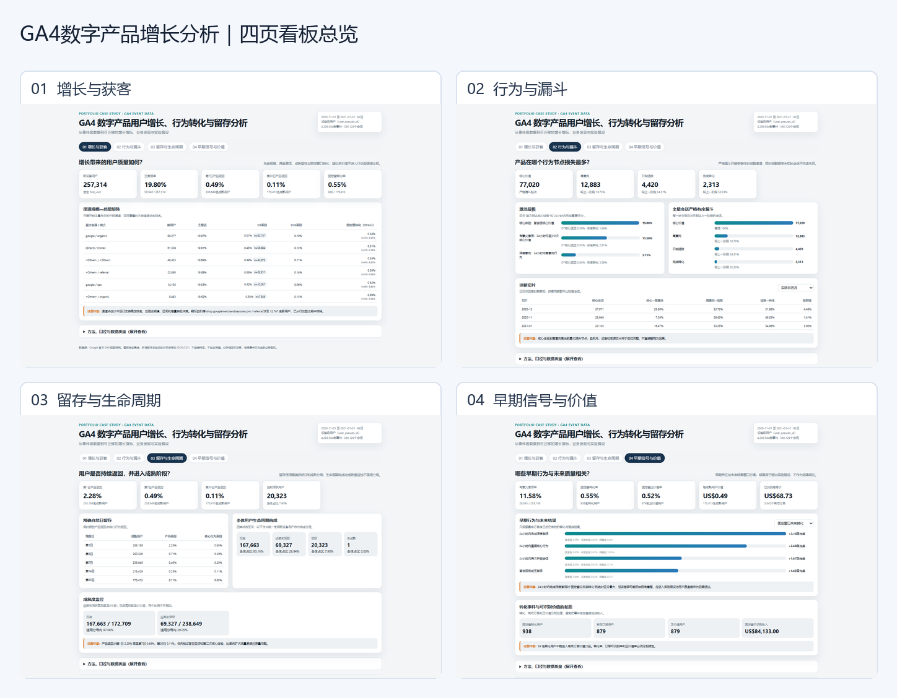

# GA4 数字产品用户增长、行为转化与留存分析

> 基于 Google Merchandise Store 官方 GA4 事件级脱敏样例数据，围绕 **获客 → 激活 → 参与 → 转化 → 留存 → 生命周期 → 用户价值**，构建可迁移的数字产品增长分析框架。

## 30 秒项目概览

**业务问题：** 用户增长是否真正转化为高质量用户？哪些早期行为和关键节点与后续留存、转化及价值相关？

**数据与方法：** 92 日、4,295,584 条事件；以设备级用户、复合会话和规范订单三层建模，使用 BigQuery SQL、Python 统计验证和离线 HTML 看板，并通过成熟分母、右删失、严格事件顺序与订单唯一性 QA 控制口径偏差。

**核心发现：**

1. 257,314 名新设备用户中，19.80% 在首会话到达核心体验，11.58% 在 24 小时内重复核心行为。
2. 严格有序漏斗的最大损失发生在“核心体验 → 高意向”，通过率仅 16.73%；2,263 个同时间戳会话因顺序未知被排除。
3. 产品返回率从第 1 日 2.28% 降至第 7 日 0.49%、第 30 日 0.11%，留存改善应优先于扩大低质量流量。
4. 24 小时内重复核心行为用户的未来转化率为 2.81%，未发生组为 0.22%，风险差 2.60 个百分点；该结果是关联，不是因果。
5. 固定 30 日成熟窗口内有 938 名转化用户，但仅 879 名能关联有效订单并产生正已识别价值，说明“转化事件”不能直接替代“用户价值”。

[查看四页交互看板](dashboard/index.html) · [查看看板总览图](dashboard/screenshots/dashboard_overview.png)

## 分析框架与业务行动

电商事件只是当前业务载体。迁移到游戏、社交、软件服务或内容产品时，可替换核心事件角色，同时保留用户/会话粒度、获客质量、激活、严格漏斗、成熟留存、生命周期、早期信号和价值结果的主体模型。

| 问题 | 行动假设 | 成功指标 | 护栏与验证 |
|---|---|---|---|
| 核心体验后大量流失 | 优化下一步推荐与高意向入口 | 严格有序核心→高意向率 | 核心体验到达率、性能；随机实验 |
| 早期重复行为与未来质量相关 | 促进 24 小时内第二次核心行为 | 有意义激活率、固定窗转化率 | 退出率；用户级实验并等待窗口成熟 |
| 留存绝对水平低 | 建立首日回访触发与内容连续性 | D7 产品/核心行为返回率 | 触达退订率；分层随机实验 |
| 渠道点估计差异不稳定 | 用规模、区间和增量共同决策 | 增量转化与增量价值 | 成本、归因、自引荐；增量实验 |

## 技术与质量证明

- BigQuery：事件、会话、用户、订单、漏斗、留存和价值模型。
- Python：Wilson 区间、风险差/风险比、多重检验与直接标准化。
- 质量门：基础层 10/10、核心层 7/7、分析层 13/13 通过；首会话覆盖率 100%，排除 `(not set)` 后有效订单跨日重复为 0。
- 单一事实来源：公开数字均可追溯至 [聚合结果](data/dashboard/dashboard_kpis.json)、[统计输出](outputs/early_behavior_effects.csv) 或 [用户与订单完整性检查](data/quality/user_order_integrity_results.csv)。

## 数据限制

这是 Google 官方脱敏样例，不是商店真实生产 KPI；用户身份为匿名设备级 `user_pseudo_id`，不能跨设备去重。观察窗口仅 92 日，渠道归因存在自引荐与未观测混杂；没有成本、退款和随机实验曝光，因此不输出可靠 CAC、利润或因果增量。

## 项目导航与复现

- [方法说明](docs/methodology.md)
- [指标定义](docs/metric_definitions.md)
- [数据质量与限制](docs/data_quality_and_limitations.md)
- [核心发现](docs/findings.md)
- [策略假设](docs/strategy_hypotheses.md)
- [技术说明](docs/technical_proof.md)
- [复现说明](docs/runbook.md)
- [SQL 分析代码](sql/README.md)
- [质量验证](sql/tests/README.md)

复现环境与执行顺序见上方“复现说明”。看板由本地已验证 JSON/CSV 构建，不连接网络，也不包含凭据。
